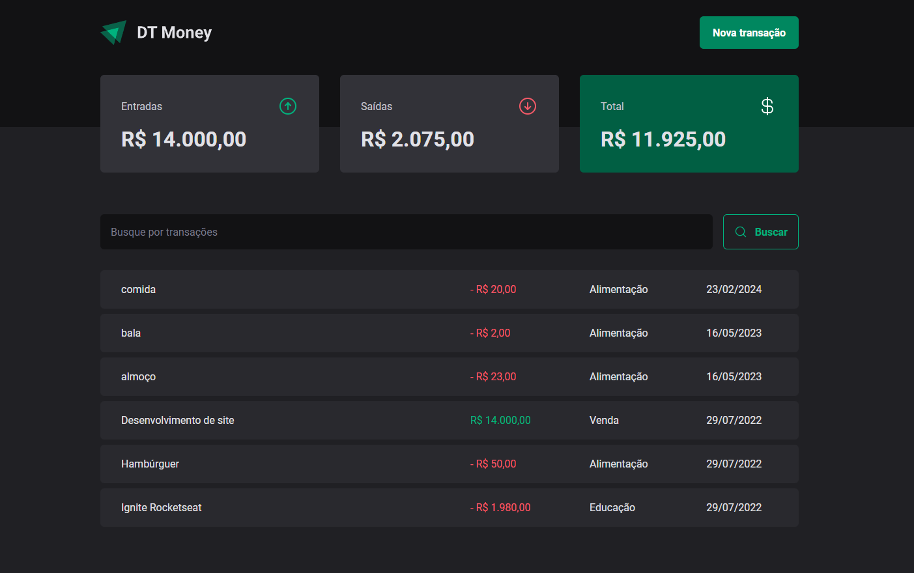
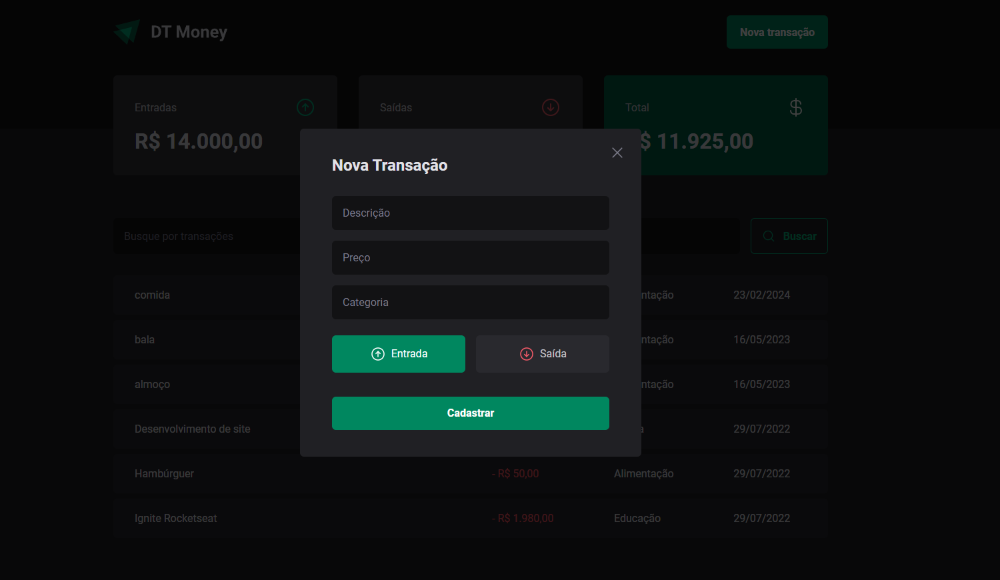

# DT Money

# App - DT Money

Esta aplicação de controle financeiro desenvolvida com React tem como objetivo ajudar os usuários a gerenciar suas finanças pessoais de forma eficiente. Com um layout intuitivo, os usuários podem acompanhar suas entradas e saídas financeiras.

## Funcionalidades

- Cadastro de Transações: Os usuários podem registrar suas transações financeiras, categorizando-as como entradas (receitas) ou saídas (despesas). Cada transação pode incluir uma descrição, valor e data.

- Visualização de Balanço: A aplicação fornece uma visão geral do balanço financeiro atual do usuário, mostrando o saldo total com base nas transações registradas.

## Telas:

    
    
    
    

    
 &nbsp;
 &nbsp;
 

  
